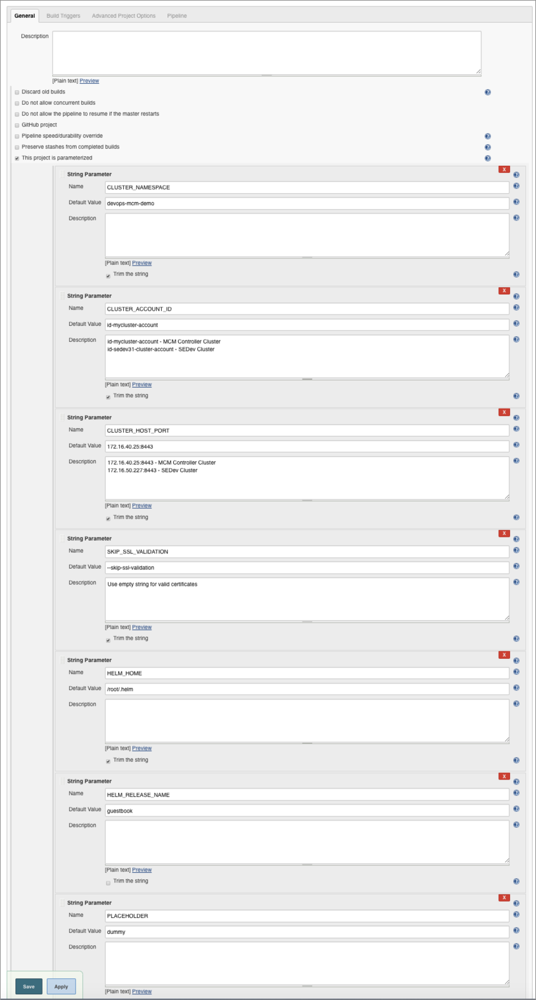
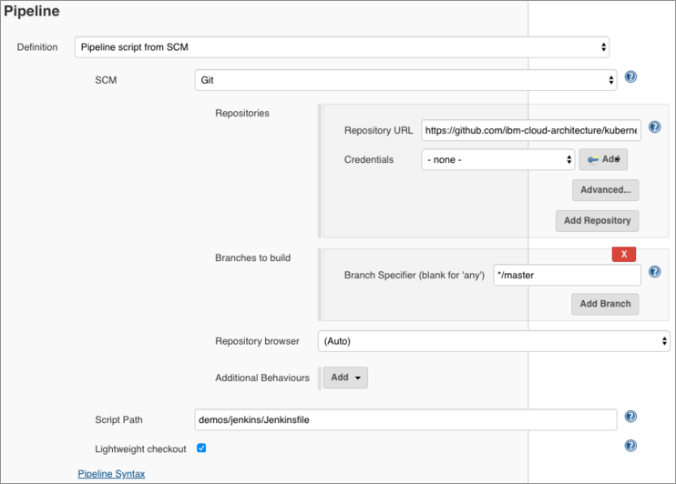
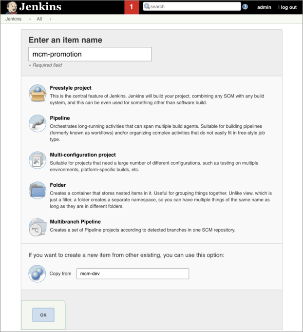
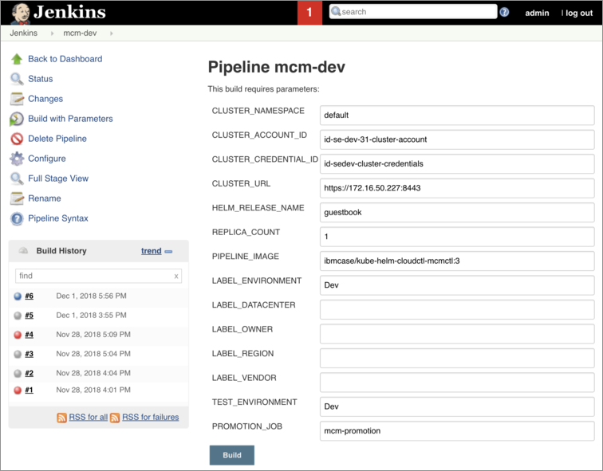
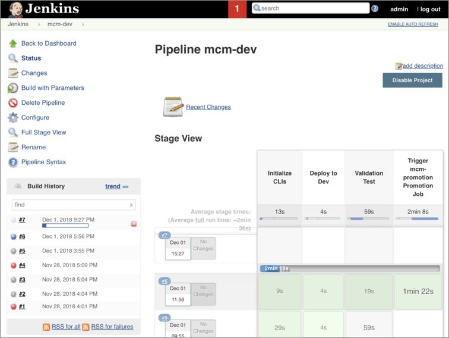
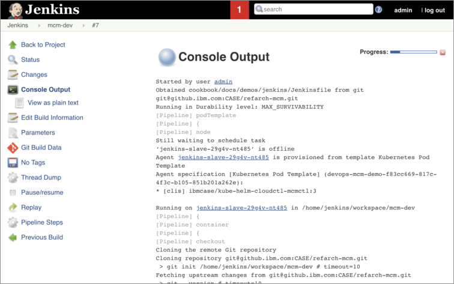
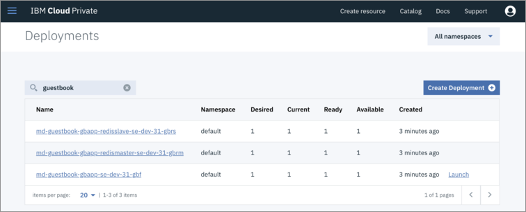

# DevOps in Multi-cluster Environment
**Author:** Fabio Gomez (fabiogomez@us.ibm.com)

This section focuses on using Jenkins and MCM command line tool `mcmctl` to run CI/CD Pipelines that deploy applications on multiple clusters.

## Introduction
Provisioning and maintaining multiple ICP clusters can be a challenge on its own. On top of that, deploying applications to multiple environments with a CICD pipeline requires highly detailed coordination. The more environments you have, managing Kubernetes service account credentials and their expiration date becomes cumbersome and time-consuming.  Now imagine that an application is made of 50 microservices and they all have to be deployed on each cluster. If you have 3 clusters, that's 150 pipelines that have to have the right environment credentials.

What happens if the certificate for one environment expires? That means you have to update the certificate in at least 50 pipelines! Even though it is a simple change, in a world of CICD where there is constantly new application updates, you just cannot afford to waste time with such trivial tasks. It would be great to have a tool that can manage certificates for you. Luckily, MCM can do just that for you. In MCM, you can securely  provide and store your clusters endpoints and certificates.  If the certificates expire, MCM will renew them for you automatically.

MCM takes advantage of its certificate management in another feature, which is the ability to deploy a helm chart to multiple clusters with a single helm install command. MCM accomplishes this, primarily, by allowing the developer to specify in the chart itself what clusters to deploy the chart to by using selector labels. When a user/pipeline performs a helm install against the MCM cluster,  MCM uses these labels to find the clusters that it will then deploy the chart to.

Using labels allows you to implement, for example, a code promotion pipeline that does the following:

  * Deploy a helm chart to all clusters with a label of type environment with a value of dev.
  * Run smoke tests against the dev clusters.
  * If tests succeed,  deploy the helm chart to all clusters with a label of type environment with a value of staging.

Note that nowhere in the above pipeline example there is a mention of cluster certificates. Granted, you still need to provide cluster certificates for the MCM cluster that does the deployments, but that's a much easier job on the developer compared to the scenarios above.

## Pre-Requisites
  * For this tutorial, your main pre-requisite is to have 2 [IBM Cloud Private](https://www.ibm.com/support/knowledgecenter/en/SSBS6K_3.1.2/kc_welcome_containers.html) clusters setup.
    + The master nodes for each clusters should be routable for MCM to be able to manage them.
    + In the following sections, you will learn how to setup MCM to manage these 2 clusters.
  * 1 x NFS server.
    + Use these [instructions](https://www.digitalocean.com/community/tutorials/how-to-set-up-an-nfs-mount-on-ubuntu-16-04) to setup a NFS server.
    + Make sure to create and expose an NFS Shared Directory, which will be used by Jenkins to persist build data.
  * [Kubectl](https://kubernetes.io/docs/user-guide/kubectl-overview/) (Kubernetes CLI)
    + Follow the instructions [here](https://kubernetes.io/docs/tasks/tools/install-kubectl/) to install it on your platform.
  * [ICP Helm](https://github.com/kubernetes/helm) (Kubernetes package manager)
    + Follow the instructions [here](https://www.ibm.com/support/knowledgecenter/en/SSBS6K_3.1.2/app_center/create_helm_cli.html) to install it on your platform.
  * [IBM Cloud Private CLI](https://www.ibm.com/support/knowledgecenter/en/SSBS6K_3.1.2/manage_cluster/install_cli.html)
    + Follow the instructions [here](https://www.ibm.com/support/knowledgecenter/en/SSBS6K_3.1.2/manage_cluster/install_cli.html) to install it on your platform.

### 1. MCM Controller and Klusterlet Cluster Preparation
The first cluster will be the `MCM Controller`, which means that this cluster will be able to manage other clusters, itself included. In order for this cluster to become the MCM Controller and manage itself, we will need to install both the `MCM Controller` and the `MCM Klusterlet` Helm Charts. The MCM Controller is in charge of monitoring and send commands to all clusters. The `MCM Klusterlet` is responsible for reporting status back to the MCM Controller and implementing its instructions.

  * Follow these [instructions](https://www.ibm.com/support/knowledgecenter/en/SSBS6K_3.1.2/mcm/installing/install.html) to install the MCM Controller and the MCM Klusterlet.
  * In the **Controller** section, enter the following values for their respective fields:
      + **Helm release name**: `mcm-controller`
  * In the **Klusterlet** section, enter the following values for their respective fields:
      + **Helm release name**: `mcm-klusterlet`
      + **Cluster Name**: `se-dev-31`
      + Check the **Deploy on Hub-Cluster?** box.
      + **All parameters (Click on the dropdown arrow)** -> **Multicloud Manager Klusterlet Configuration**:
          - **cloud**: `IBM`
          - **datacenter**: `austin`
          - **environment**: `Dev`
          - **owner**: `case`
          - **region**: `US`
          - **vendor**: `ICP`

If the above was done correctly, you have successfully setup the first cluster and can now manage it through `MCM Controller`.

### 2. MCM Klusterlet Cluster Preparation
The second cluster will only contain the `MCM Klusterlet` that reports information back to the `MCM Controller` cluster.

  * Follow these [instructions](https://www.ibm.com/support/knowledgecenter/SSBS6K_3.1.2/mcm/installing/klusterlet.html) to install the MCM Klusterlet.
  * Enter the following values for their respective fields:
      + **Helm release name**: `mcm-klusterlet`
      + **Cluster Name**: `se-stg-31`
      + **All parameters (Click on the dropdown arrow)** -> **Multicloud Manager Klusterlet Configuration**:
          - **cloud**: `IBM`
          - **datacenter**: `dallas`
          - **environment**: `Staging`
          - **owner**: `case`
          - **region**: `US`
          - **vendor**: `ICP`

If the above was done correctly, you have successfully setup the first cluster and can now manage it through the `MCM Controller` in the first cluster.

### 3. Create Image Policies on Both Clusters
Since ICP version 3.1, you are required to create `Image Policies` that allow you to pull Docker images from specific Docker registries (`gcr.io` in our case). To do so, let's start by cloning the project's git repository:
```bash
# Clone the Reference Architecture Repository
git clone https://github.com/ibm-cloud-architecture/kubernetes-multicloud-management.git

# Go to the project's folder
cd kubernetes-multicloud-management
```

Now, on `EACH ICP CLUSTER`, let's run the following commands:
```bash
# Login to the ICP Cluster
cloudctl login -a https://ICP_MASTER_IP:8443 -n default --skip-ssl-validation

# Create the Image Policy in the ICP Cluster
kubectl apply -f demos/guestbook/guestbook-cluster-image-policy.yaml
```

Don't forget to run the above commands on `EACH ICP Cluster` so that there are no issues when deploying the guestbook application.

## Jenkins MCM CI/CD Tutorial
Here is the High Level Jenkins-MCM DevOps Architecture Diagram and CI/CD Workflow:


The main things to notice are the following:

  * A Jenkins instance will be deployed on a IBM Cloud Private (Kubernets) cluster.
  * Jenkins will use `mcmctl` to deploy applications through the MCM Controller.
  * MCM Controller will use Placement Policies to decide what clusters to deploy the application to.
  * Not all available clusters will be selected to deploy the application to, as shown by the missing arrow to the `Prod Cluster`

### This guide will help install the following resources:
  * 1 x 10Gi [Persistent Volume Claim](https://kubernetes.io/docs/concepts/storage/persistent-volumes/) (PVC) to Store Jenkins data and builds' information.
    + Be sure that your Kubernetes Cluster can support PVCs size of at least 10Gi
  * 1 x Jenkins Master Kubernetes Pod with Kubernetes Plugin Installed.
  * 1 x Kubernetes Service for above Jenkins Master Pod with port 8080 exposed to a LoadBalancer.
  * Ingress to expose Jenkins service (HTTP/8080), externally (HTTPS/443)
  * All using Kubernetes Resources.

## 1. Install Jenkins Chart
We are now going to start the process of installing the [Community Jenkins Helm Chart](https://github.com/helm/charts/tree/master/stable/jenkins). Feel free to pick any of the ICP clusters for the remaining of this guide to setup Jenkins, but make sure you run all the following commands against `ONLY ONE CLUSTER`.

Let's start by going to the Jenkins folder, followed by a `cloudctl login`:
```bash
# Go to the Jenkins folder
cd demos/jenkins/deploy

# Login against the ICP Cluster that will contain the Jenkins instance
cloudctl login -a https://ICP_MASTER_IP:8443 -n default --skip-ssl-validation
```

Now we are ready to start setting up the Jenkins instance.

### a. Create a new namespace
Create a new namespace `mcm-devops-demo`. This namespace will be used for CI/CD setup purposes. User may require 'cluster admin' access to create a new namespace. if you encounter any issues creating namespace, reach out to ICP admin for the same.
```bash
# Create mcm-devops-demo namespace
kubectl create namespace mcm-devops-demo
```

### b. Create Jenkins Image Policy
Since we will be deploying the Jenkins Helm chart, we will need to create a Cluster Image Policy that allows the cluster to pull the Jenkins and the custom Jenkins Slave images from Docker Hub. To do so, run the following command:
```bash
# Create the Image Policy in the Jenkins ICP Cluster
kubectl apply -f jenkins-cluster-image-policy.yaml
```

### c. Create a Persistence Volume Claim
Create Persistence Volume (PV) and a Persistence Volume Claim (PVC) using the NFS Shared Directory you created earlier. To create the PV and the PVC, open the [jenkins-pvc.yaml](demos/jenkins/deploy/jenkins-pvc.yaml) and change the values of Lines [16](https://github.com/ibm-cloud-architecture/kubernetes-multicloud-management/blob/master/demos/jenkins/deploy/jenkins-pvc.yaml#L16) and [17](https://github.com/ibm-cloud-architecture/kubernetes-multicloud-management/blob/master/demos/jenkins/deploy/jenkins-pvc.yaml#L17) to the NFS server's IP Address and the Share Directory's absolute path, respectively. Then save the file and create the PV and PVC with the following command:
```bash
# Create the PV and PVC
kubectl apply -f jenkins-pvc.yaml
```

Wait a few seconds/minutes for the PVC to be bound and ready. To verify that the PVC has been successfully bound, run the following command:
```bash
# Check that PVC status
kubectl -n mcm-devops-demo get pvc
NAME                        STATUS   VOLUME                CAPACITY   ACCESS MODES   STORAGECLASS   AGE
jenkins-master-claim        Bound    jenkins-master        10Gi       RWO                           1d
```

If you see the above PVC with a Status of `Bound`, that means that your PVC is ready to be used!

### d. Install the Jenkins Helm Chart
Let's finally install the [Community Jenkins Helm Chart](https://github.com/helm/charts/tree/master/stable/jenkins). We will be using our own [values.yaml](https://github.com/ibm-cloud-architecture/kubernetes-multicloud-management/blob/master/demos/jenkins/deploy/jenkins-values.yaml) file to setup things like admin password, a `/jenkins` prefix (which will be used by ingress), and to use the PVC we created in the above section. To install the chart, run the following command:
```bash
# Install the Jenkins Helm Chart
helm upgrade --namespace mcm-devops-demo --install jenkins -f jenkins-values.yaml stable/jenkins --tls
```

The Jenkins container will take a few minutes to start and be fully initialized. To access the Jenkins instance once it's ready, you will need to create an Ingress entry as shown in the next section.

### e. Create Jenkins Ingress
To be able to access the Jenkins instance, you will need an Ingress record that forwards traffic from the Ingress IP address to the Jenkins pod. To create the Ingress, run the following command:
```bash
kubectl apply -f jenkins-ingress.yaml
```

To get the Ingress IP address, run the following command:
```bash
kubectl get ingress -n mcm-devops-demo
NAME                   HOSTS   ADDRESS         PORTS   AGE
jenkins-ingress        *       172.16.50.228   80      1d
```

If you see the `jenkins-ingress` listed, the IP Address will be listed under the `ADDRESS` column.

### f. Login to Jenkins
Finally, to let's test that the Ingress was created successfully by trying to access Jenkins from your browser. Open a new browser window and go to `http://ICP_INGRESS_IP/jenkins`. You should be greeted with a login window

  

Now enter `admin` and `admin_0000` (as defined in the `jenkins-values.yaml` file) for username and password, respectively and click the `Sign In` button.

If the login worked, then that means that you have successfully installed Jenkins on your ICP cluster!

**NOTE**: Depending on what version of Jenkins gets installed from the Helm Chart, you may be asked to upgrade some of the Jenkins plugins that were installed with the chart, which is beyond the scope of this document, to ensure that the pipelines work flawlessly. Just know that if you get an error that doesn't make sense while running your pipelines, it may be because your Jenkins plugins need an upgrade.

## 2. Configure Jenkins
The Jenkins configuration will be default. However, we need to create a Credentials entry for the username and password for the MCM Controller ICP cluster. To create the credentials, open a browser window and go to `http://ICP_INGRESS_IP/jenkins/credentials/store/system/domain/_/newCredentials` and select `Username with password` for **Kind**.


Enter the admin username and password for the ICP cluster. Please make that you enter `id-sedev-cluster-credentials` for the **ID** field, as this is the Jenkins credentials id that will be used by the pipeline.

Depending on whether you are accessing this repository from your own fork or from our repository directly, you may be asked to setup a private ssh key for your GitHub username. To do so, open a browser window and go to `http://ICP_INGRESS_IP/jenkins/credentials/store/system/domain/_/newCredentials` and select `SSH Username with private key` for **Kind**.


Now enter your GitHub username and your Private SSH key in the **Username** and **Private Key** fields, respectively.

Now we are ready to start setting up the CI/CD Pipeline.

## 3. Create 2 CI/CD Pipelines
Now we are going to create 2 pipeline projects. The first pipeline project will be called `mcm-dev` and, as the name implies, will be used to deploy the `guestbook` app to the `se-dev-31` cluster. The second pipeline will be called `mcm-promotion` and, as the name implies, it will be used to promote the `guestbook` deployment from the `se-dev-31` to the `se-stg-31` cluster.

### a. Pipeline Code Overview
The pipeline code (which you can checkout [here](https://github.com/ibm-cloud-architecture/kubernetes-multicloud-management/blob/master/demos/jenkins/Jenkinsfile)) consists of the following 4 stages:

  1. **Initialize CLIs**
    * In this stage, the pipeline will log against the MCM Controller cluster and initialize contexts for `kubectl`, `helm`, and `mcmctl` CLIs.
  2. **Deploy to X**
    * As the name implies, this is the stage in which the `guestbook` application will be deployed (via `helm`) to the specified environment.
    * Because we are logged against the MCM Controller cluster, the MCM Controller will look at the `gbapp` chart and figure out, based on the cluster selector labels and the specified number of replicas, what clusters and how many clusters to deploy the application to.
  3. **Validation Test**
    * In this stage, as the name implies, we will be performing a validation test to confirm that the `guestbook` application was deployed to the correct cluster. Also, a simple functional test will be done to make sure that we get the web application's HTML code.
    * The validation test itself is done as follows:
      + Use `mcmctl` with cluster specific selectors to verify that the `guestbook` deployments exist in the cluster.
        - Wait until the guestbook deployments show up in the cluster.
      + Use `mcmctl` to obtain the available replicas for each deployment.
        - Wait until there is at least 1 available replica.
      + Use `mcmctl` to get the IP Address (or domain name) of the cluster's Ingress for the `geustbook` frontend service.
      + Finally, use `curl` to query the `guestbook` frontend service using the Ingress from above and check that we get the guestbook frontend HTML code.
  4. **Trigger Promotion Job**
    * Assuming that we provided the name of the promotion job and that the pipeline passes validation tests, this step will trigger the `mcm-promotion` pipeline, which runs the same stages minus the **Trigger Promotion Job** stage.
    * The `mcm-promotion` pipeline uses the same pipeline code (with different cluster selector labels and a replica count of 2) to deploy the `guestbook` app to both `se-dev-31` and `se-stg-31` clusters.
    * In this case, since the `guestbook` application was already deployed to the `se-dev-31` cluster, MCM will simply keep that deployment as is and deploy the `guestbook` application to the `se-stg-31` cluster, thus satyisfying the requirements.

### b. Creating the mcm-dev pipeline
Now that we understand the pipeline code at a high level, we can proceed with creating the pipelines, which is the easier part. Let's start by creating the `mcm-dev` pipeline with the following steps:

  * From the Jenkins Home page, click on **Jenkins-> New Item**.
  * Enter `mcm-dev` for the **Item Name**.
  * Select `Pipeline` as project type.
  * Click the `OK` Button.
  * This will bring you to the Pipeline Configuration view.
  

Now that we have created the pipeline, in the following sections you will setup the pipeline environment variables and the git repository details.

#### i. Setup the Environment Variables
Let's setup the pipeline environment variables, which contain the cluster specific information needed to deploy the `guestbook` application into the `se-dev-31` cluster. We will explain all of the variables that you need to enter, which result in a configuration similar to the following
    

On the **General** section of the Pipeline Configuration view, check the `This project is parameterized` box, which will expose the `Add Parameter` dropdown. Then click **Add Parameter -> String Parameter** and create the following parameters with their respective `Name` and `Default Value`:

  * **CLUSTER_NAMESPACE**: `default`
    + This is the cluster namespace on which the `guestbook` application will be deployed to.
  * **CLUSTER_ACCOUNT_ID**: `id-se-dev-31-cluster-account`
    + This is the IBM Cloud Private account ID that `cloudctl` will log in against.
    + Assuming that you named this cluster `se-dev-31` then the above ID will apply.
    + If you created your cluster under a different name, then it might show up as `id-CLUSTER-NAME-cluster-account`.
    + To find out the exact id name of the account, perform a `cloudctl login` and when you get to the account selection you will see the account ID between parenthesis.
  * **CLUSTER_CREDENTIAL_ID**: `id-sedev-cluster-credentials`
    + This is the Jenkins credential id for the ICP cluster's username and password that we created in a previous step.
  * **CLUSTER_URL**: `https://MCM_CONTROLLER_CLUSTER_MASTER_IP:8443`
    + The URL for the MCM Controller cluster, which uses the IP Address of the master node.
  * **HELM_RELEASE_NAME**: `guestbook`
    + The helm release name of the guestbook application.
  * **REPLICA_COUNT**: `1`
    + The replica count is the number of matching clusters that the `guestbook` application will be deployed into.
    + Since this is the `mcm-dev` pipeline, we will set this to just `1`.
  * **PIPELINE_IMAGE**: `ibmcase/kube-helm-cloudctl-mcmctl:3.1.2`
    + The docker image that contains all of the CLIs needed by the pipeline, which are `cloudctl`, `mcmctl`, `kubectl`, and `helm`.
    + This image is publicly available on our Docker Hub and the source can be found [here](https://github.com/ibm-cloud-architecture/kubernetes-multicloud-management/blob/master/demos/docker/Dockerfile).
    + **NOTE:** We built this image for demo purposes, which means that it should NOT be used for PRODUCTION. For that, you will have to create your own Docker image with the specific versions of the CLIs that you wish to use.
  * **LABEL_ENVIRONMENT**: `Dev`
    + This is the `Environment` cluster selector label that we will use to select the `se-dev-31` cluster to deploy the `guestbook` application.
    + Notice that we ser the value to `Dev` to match the cluster selector that was assigned to `se-dev-31` when we installed the Klusterlet earlier.
  * **TEST_ENVIRONMENT**: `Dev`
    + This variable is used to determine what cluster/environment to perform validation tests against.
    + It may look as unnecessary to have this label since we have **LABEL_ENVIRONMENT** set to `Dev`, but you will notice in the next section when we deploy the `guestbook` application against multiple clusters that we will have to choose one environment to perform the validation test against.
  * **PROMOTION_JOB**: `mcm-promotion`
    + When this variable is set and the pipeline successfully passed the validation tests, the pipeline will automatically trigger then `mcm-promotion` pipeline, which will deploy the `guestbook` application to the `se-stg-31` cluster along with `se-dev-31`.

You are done setting up all the environment variables.

#### ii. Setup the git repository
Now we need to setup the Pipeline git repository details, which will tell Jenkins the git repository and the location where the Jenkinsfile is located.  We will explain all of the settings that you need to enter, which result in a configuration similar to the following:

  

On the **Pipeline** section of the Pipeline Configuration view do the following:

  * Select `Pipeline script from SCM` on the **Definition** field.
   Select `Git` on the **SCM** field
  * Enter `https://github.com/ibm-cloud-architecture/kubernetes-multicloud-management` in the **Repositories -> Repository URL** field.
    + If using `SSH` to clone the repository, enter `https://github.com/ibm-cloud-architecture/kubernetes-multicloud-management.git` instead.
    + Also, if using `SSH`, in the **Credentials** field select the `SSH Credentials` that you created earlier.
  * Enter `*/master` in the **Branches to build -> Branch Specifier** field.
  * Enter `demos/jenkins/Jenkinsfile` in the **Script Path** field.

#### iii. Save the pipeline configuration
Now that you have configured pipeline, go ahead and click the `Save` button to save your the pipeline configuration.

### c. Creating the mcm-promotion pipeline
Now let's move on to creating the `mcm-promotion` pipeline. Luckily for you, creating this pipeline will be much easier since we can just copy the `mcm-dev` pipeline and change some environment variables, which saves us time.

To create the `mcm-promotion` pipeline, do the following:

  * From the Jenkins Home page, click on **Jenkins-> New Item**.
  * Enter `mcm-promotion` for the **Item Name**.
  * Enter `mcm-dev` in the **Copy from** towards the bottom.
  * Click the `OK` Button.
  * This will bring you to the Pipeline Configuration view with pre-filled Environment Variables and Repository details from the `mcm-dev` pipeline.

  

Now go to the **General** section and enter the following values for the environment variables below:

  * **CLUSTER_NAMESPACE**: `default`
  * **CLUSTER_ACCOUNT_ID**: `id-se-dev-31-cluster-account`
  * **CLUSTER_CREDENTIAL_ID**: `id-sedev-cluster-credentials`
  * **CLUSTER_URL**: `https://MCM_CONTROLLER_CLUSTER_MASTER_IP:8443`
  * **HELM_RELEASE_NAME**: `guestbook`
  * **REPLICA_COUNT**: `2`
    + Since we want to deploy the application to both `se-dev-31` and `se-stg-31` clusters, we set the replica count to `2`.
  * **PIPELINE_IMAGE**: `ibmcase/kube-helm-cloudctl-mcmctl:3.1.2`
  * Rename **LABEL_ENVIRONMENT** to **LABEL_OWNER** and set the value to `case`
    + Since both `se-dev-31` and `se-stg-31` share the `Owner` cluster selector label with a value of `case`, we can use this label to select both cluster as deployment candidates for the `guestbook` application.
  * **TEST_ENVIRONMENT**: `Staging`
    + Since the goal to this pipeline is to promote/deploy the `guestbook` application to `se-stg-31` cluster, we will set the test environment as `Staging`.
  * Remove the **PROMOTION_JOB** variable or set its value to an empty string.
    + Since this pipeline is the promotion pipeline, there is no need to automatically trigger another promotion pipeline.
    + To promote an application to a production environment, it is best practice for a human to manually trigger the pipeline, watch its progress, and correct any issues that it may come accross.

Now that you have configured pipeline, go ahead and click the `Save` button to save your the pipeline configuration.

## 4. Running the Pipelines
Whew, setting up those pipelines took a lot of work but now comes the rewarding part. We are finally going to run the pipelines! To run the `mcm-dev` pipeline, do the following:

  * From the Jenkins home page select the `mcm-dev` item, then click `Build with parameters`, which will take you to a view similar to the following, where you can edit the Environment Variables, if needed:

    

  * Click `Build` to start the pipeline, which will take you back to the project view.

From the `mcm-dev` project view, click on the latest build number (in the above picture it would be #7) to view build details.

  

To access the build logs, click on the `Console Output` button.

  

I'll let you look into the logs to figure out what's going on. The best way to read the logs is by matching the output you see with the pipeline stages we went through earlier in the [Pipeline Code Overview](#a-pipeline-code-overview) section.

An important detail to know is that towards the end of the pipeline output, if the `Validation Test` stage completed successfully, you will notice that the pipeline triggers the `mcm-promotion` job and starts a new build for it, as shown below:

  

If you would like to see output of the `mcm-promotion` job build, just click the `mcm-promotion` build number (#2 in the above picture). The way Jenkins treats jobs that trigger builds for other jobs is that it will wait until the triggered jobs finish before finishing the current job. In our case, the `mcm-dev` job build will wait until `mcm-promotion` job build finishes before it can finish itself.

Finally, you will know that the pipeline finished successfully if you see `Finished: SUCCESS` as the last line of console output. If that's the case, then CONGRATULATIONS!!! You have successfully run an MCM CI/CD pipeline that automatically deploys the `guestbook` application to the `se-dev-31` cluster but also, upon passing the validation tests, triggers the `mcm-promotion` pipeline to deploy the application to the `se-stg-31` cluster.

Now let's move on to manually testing the `guestbook` application on each cluster to verify that the pipelines indeed deployed the application successfully.

## 5. Test the Guestbook Application
There are 2 ways in which we can access the `guestbook` application's frontend on each cluster:

  1. Getting the application URL from the Jenkins build output.
  2. From the `Deployments` page in the IBM Cloud Private console of each cluster.

### a. Getting the application URL from the Jenkins build output
On the **Validation Test** stage you will see a link to the `guestbook` application's frontend URL in the logs as shown below:

  

To access the guestbook application just click on the URL and you will be taken to the web application in your browser.

This step applies to both `mcm-dev` and `mcm-promotion` jobs.

### b. Launching the application from the IBM Cloud Private Console
You can also launch the `guestbook` frontend from the IBM Cloud Private console. To do so, open a new browser window and go to `https://ICP_MASTER_IP:8443/console/workloads/deployments` and enter `guestbook` in the search bar. If done correctly, you will see a view like the following:

  

If you are able to see the `md-guestbook-gbapp`, `md-guestbook-gbapp-redismaster`, and `md-guestbook-gbapp-redisslave` deployments and all have an **Available** value of `1`, then this means that all of the deployments have succesfully been deployed and started. At this point, all it takes to launch the application is to click the `Launch` button in the `md-guestbook-gbapp` row.

This step applies to both `se-dev-31` and `se-stg-31` clusters.

### c. Testing the Application
The guestbook application itself is very simple. It consists of a web application that saves `guest` names (or any text) to a Redis deployment and persists them there even if the web application dies or restarts for some reason. To test its functionality, enter any text in the textbox shown below and click the `Submit` button.

  

If everything worked successfully, you will see that the text you entered has now moved below the Submit button, which indicates that the text has been saved to and successfully read from the Redis deployment. To make sure that the text persists in the Redis deployment, feel free to refresh the page and make sure that the text you entered is bein shown again below the `Submit` button.

If all the above was done successfully, that means that you have successfully verified the guestbook deployment and tested its functionality!

## Conclusion
An automated CI/CD pipeline is the holy grail of a true DevOps setup. It enforces code quality by doing things like Validation Tests. It also saves many headaches when deploying new code to new environments because everything is automated.

The problem with the traditional CI/CD approach is that the more environments you have (which is common in big enterprises), the more difficult and error prone it becomes to set up multiple CI/CD pipelines because you have to take many configuration settings and credentials into account for each environment.

Thankfully, MCM takes care of saving all of the environment settings and credentials for you and lets you deploy applications to these environments by supplying values for easy-to-read cluster selector labels, as you saw in the examples above. The only thing that the developer has to remember is the login information for the MCM Controller cluster and the values for the cluster selector labels.

Now that you have the knowledge of using MCM in your CI/CD pipelines, I encourage you to try this out with your own workloads!